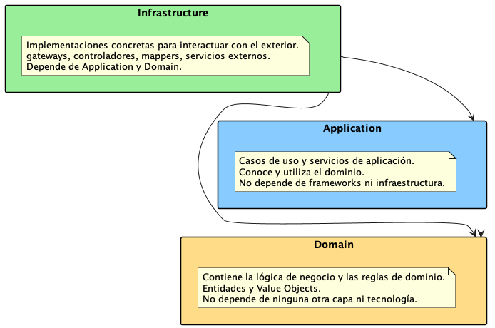
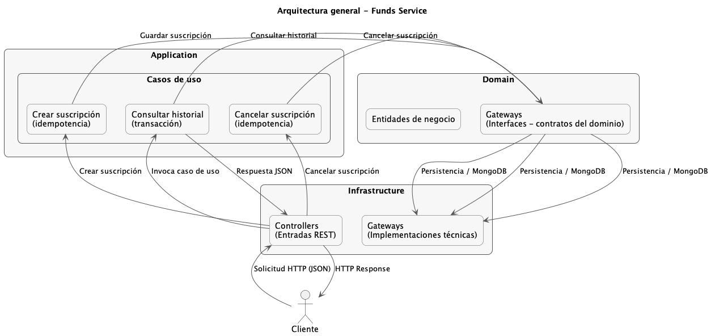
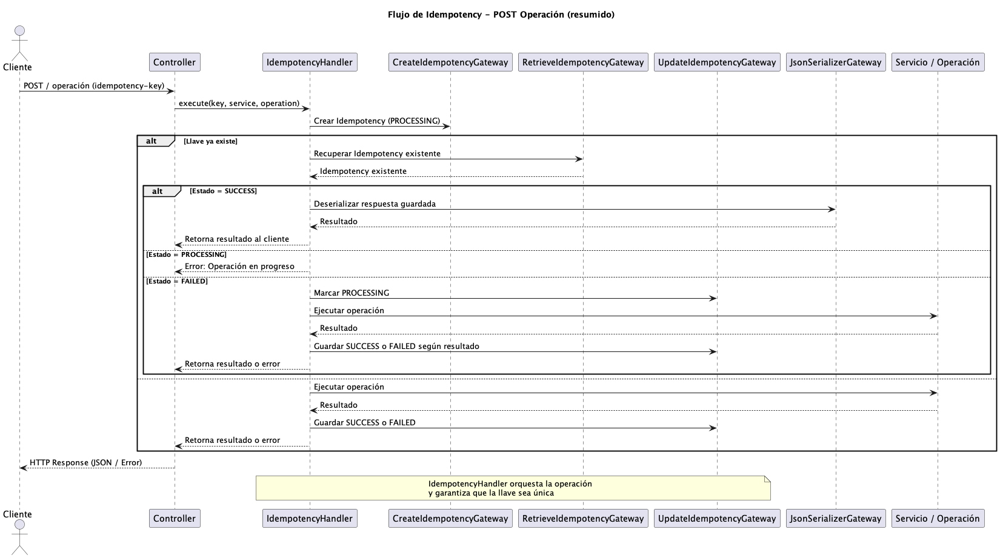
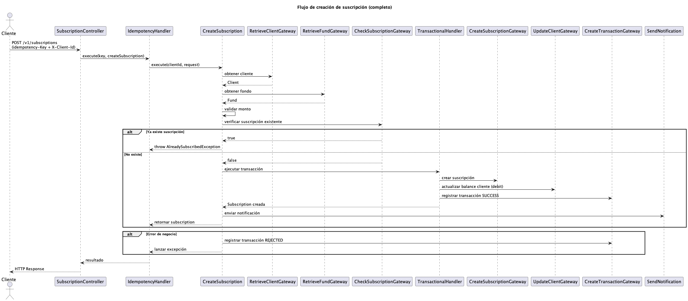
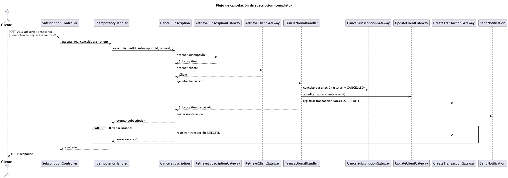
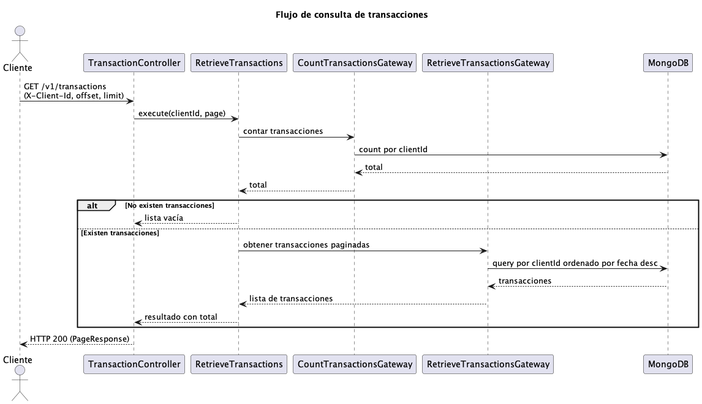
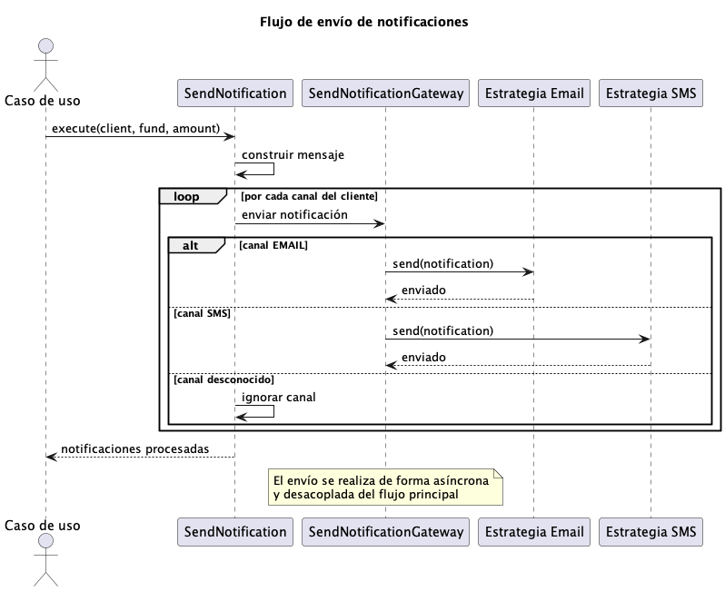

# Funds Service - Gestión de Fondos y Suscripciones

API RESTful para la gestión de clientes, fondos y suscripciones, desarrollada con **Spring Boot** y **Java 17**.

El servicio modela operaciones financieras reales como:
- creación y cancelación de suscripciones a fondos
- movimientos de dinero (débito y crédito sobre el balance del cliente)
- registro de transacciones para trazabilidad

Incluye además:
- control de **idempotencia** para operaciones `POST`
- ejecución **transaccional** de operaciones críticas
- manejo de **errores de negocio** con registro de transacciones rechazadas
- sistema de **notificaciones desacoplado y asíncrono**
- consultas paginadas optimizadas para historial de transacciones

El diseño sigue una arquitectura **hexagonal (ports & adapters)**, separando claramente dominio, casos de uso e infraestructura.

---

## Cómo ejecutar

### Requisitos

- **Java 17+**
- **Gradle 8+**
- **MongoDB** (puede ejecutarse en Docker)

```bash
docker run -d --name mongodb -p 27017:27017 mongo:latest --replSet rs0
```

### Clonar y ejecutar

```bash
git clone https://github.com/leonardo1317/funds-management-service.git
cd funds-management-service
./gradlew bootRun
```

La API se iniciará en: http://localhost:8080

---

## Variables de entorno

| Variable                 | Descripción |
|--------------------------|-------------|
| `MONGODB_URI`            | URI de conexión a MongoDB (default `${MONGODB_URI:mongodb://localhost:27017/funds_db?replicaSet=rs0}`) |
---

## Base de datos (MongoDB)

Principales colecciones:

- **clients** – Información de clientes
- **subscriptions** – Suscripciones y su estado
- **transactions** – Movimientos financieros
- **idempotency** – Control de operaciones idempotentes
- **funds** – Fondos disponibles

---

## Documentación de la API

Swagger UI disponible en:  
[http://localhost:8080/docs](http://localhost:8080/docs)

---

## Arquitectura

Se sigue un patrón **Hexagonal / Ports & Adapters**, con separación clara entre:

- **Domain**: lógica de negocio y entidades.
- **Application**: casos de uso y servicios de aplicación.
- **Infrastructure**: implementaciones concretas (Mongo, REST, mappers).

### Diagrama de capas general



### Diagrama de arquitectura lógica



### Diagrama de secuencia - Idempotencia



### Diagrama de secuencia - Creación de suscripción



### Diagrama de secuencia - Cancelación de suscripción



### Diagrama de secuencia - Consultar transacciones



### Diagrama de secuencia - Enviar notificación



---

## Licencia

Proyecto desarrollado con fines educativos.  
**Autor:** Leonardo Romero (leonardo1317)  
**Licencia:** Apache License 2.0